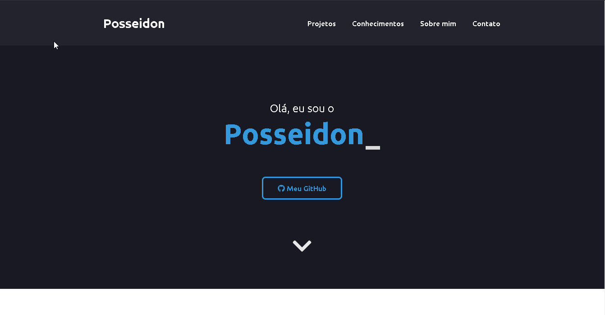
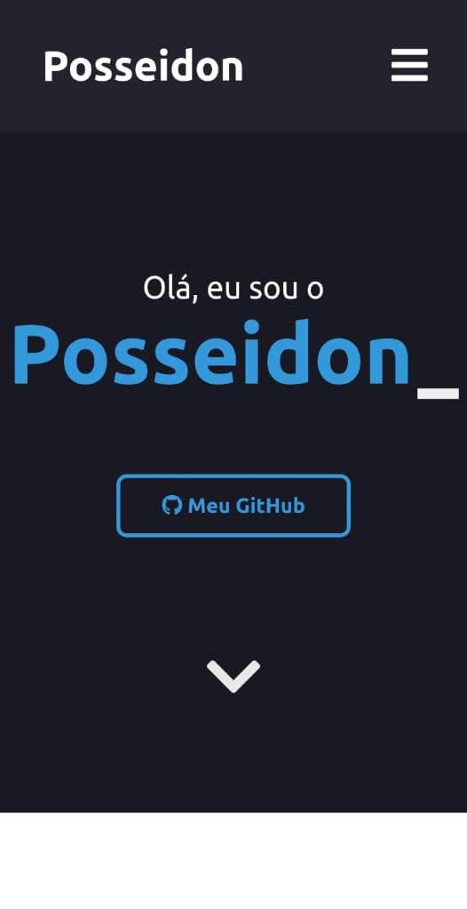

<h1> Meu portfólio </h1>

<h4>Site: https://posseidon.netlify.app/</h4>

 Website com meus projetos, conhecimentos, contato. Feito usando VueJS

 Inspirado no portfolio do <a href="https://github.com/iuricode/portfolio">iuricode</a>

 
 

<h2>Seções</h2>

- <b>Início:</b> Começo do site com animação no meu nome.
- <b>Projetos:</b> Alguns projetos meus.
- <b>Conhecimentos:</b> Tecnologias que tenho conhecimento.
- <b>Sobre mim:</b> Pequeno texto contando um pouco sobre mim.
- <b>Contato:</b> Links para me contactar.

 
 

<h2>Tecnologias Usadas</h2>

- VueJS
- FontAwesome
- SCSS

<h4 align="center">Feito por Posseidon&#169;</h4>
